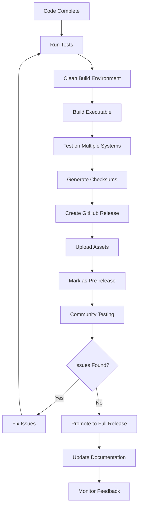

# PyPass Publishing Guide

## 📦 Complete Guide to Publishing Your First Release

This guide ensures PyPass will work properly on every user's device who downloads the .exe file.

## 🚀 Pre-Release Checklist

### 1. Code Preparation

**✅ Version Management**
- [ ] Update version number in relevant files
- [ ] Ensure all code changes are committed
- [ ] Create and push a version tag (e.g., `v1.0.0`)

**✅ Code Quality**
- [ ] Run final verification script: `python final_verification.py`
- [ ] Test all features manually in development
- [ ] Verify all imports and dependencies work
- [ ] Check for any hardcoded paths or system-specific code

### 2. Build Environment Setup

**✅ Clean Environment**
```bash
# Create fresh virtual environment
python -m venv .venv-release
.venv-release\Scripts\activate  # Windows
pip install --upgrade pip
pip install -r requirements.txt
```

**✅ System Requirements**
- [ ] Python 3.11+ installed
- [ ] PyInstaller 5.13.0+ installed
- [ ] 500MB free disk space for build process
- [ ] Windows 10+ (for Windows builds)

### 3. Build Process

**✅ Clean Build**
```bash
# Clean any previous builds
if exist "dist" rmdir /s /q "dist"
if exist "build\build" rmdir /s /q "build\build"

# Run the build script
build_exe.bat
```

**✅ Build Verification**
- [ ] `dist\PyPass.exe` file exists
- [ ] File size is reasonable (typically 15-30MB)
- [ ] No error messages during build
- [ ] Build log shows successful completion

### 4. Compatibility Testing

**✅ Test on Multiple Environments**

**Primary Testing (Required):**
- [ ] Windows 10 (clean install)
- [ ] Windows 11 (clean install)
- [ ] Test on machine WITHOUT Python installed
- [ ] Test on machine WITHOUT Visual C++ redistributables

**Secondary Testing (Recommended):**
- [ ] Windows Server 2019/2022
- [ ] Different user account types (Admin vs Standard)
- [ ] Antivirus software enabled (Windows Defender + others)

**✅ Functionality Testing**
- [ ] Application launches without errors
- [ ] All GUI elements display correctly
- [ ] Password generation works
- [ ] Copy to clipboard functions
- [ ] File save functionality works
- [ ] All error handling works properly

### 5. Security and Performance Testing

**✅ Security Verification**
- [ ] No network connections attempted (use network monitor)
- [ ] No files created outside application directory
- [ ] No registry modifications
- [ ] Antivirus scan passes (VirusTotal recommended)

**✅ Performance Testing**
- [ ] Application starts within 5 seconds
- [ ] Password generation completes within 2 seconds
- [ ] Memory usage stays under 50MB
- [ ] No memory leaks during extended use

## 🔧 Build Optimization

### Enhanced Build Script

Create `build_release.bat` for production builds:

```batch
@echo off
echo PyPass Release Build Script
echo ========================

REM Verify environment
python --version || (echo Python not found && exit /b 1)
python -c "import sys; print(f'Python {sys.version}')"

REM Clean environment
echo Cleaning previous builds...
if exist "dist" rmdir /s /q "dist"
if exist "build\build" rmdir /s /q "build\build"

REM Install/update PyInstaller
echo Installing PyInstaller...
python -m pip install --upgrade pyinstaller>=5.13.0

REM Build with optimizations
echo Building optimized executable...
python -m PyInstaller build\pypass.spec --clean --noconfirm --log-level INFO

REM Verify build
if exist "dist\PyPass.exe" (
    echo Build successful!
    for %%F in ("dist\PyPass.exe") do echo File size: %%~zF bytes
    
    REM Generate checksum
    certutil -hashfile "dist\PyPass.exe" SHA256 > "dist\PyPass.exe.sha256"
    echo Checksum generated: dist\PyPass.exe.sha256
) else (
    echo Build failed!
    exit /b 1
)

echo.
echo Release build complete!
pause
```

### Spec File Optimization

Update `build\pypass.spec` for production:

```python
# -*- mode: python ; coding: utf-8 -*-

block_cipher = None

a = Analysis(
    ['../main.py'],
    pathex=['..'],
    binaries=[],
    datas=[],
    hiddenimports=[
        'tkinter',
        'tkinter.ttk',
        'tkinter.messagebox',
        'tkinter.filedialog',
        'secrets',
        'hashlib',
        'datetime',
        'threading',
        'time',
        're'
    ],
    hookspath=[],
    hooksconfig={},
    runtime_hooks=[],
    excludes=[
        # Exclude unnecessary modules to reduce size
        'matplotlib', 'numpy', 'pandas', 'PIL', 'cv2',
        'PyQt5', 'PyQt6', 'PySide2', 'PySide6',
        'jupyter', 'IPython', 'notebook',
        'scipy', 'sklearn', 'tensorflow', 'torch'
    ],
    win_no_prefer_redirects=False,
    win_private_assemblies=False,
    cipher=block_cipher,
    noarchive=False,
)

pyz = PYZ(a.pure, a.zipped_data, cipher=block_cipher)

exe = EXE(
    pyz,
    a.scripts,
    a.binaries,
    a.zipfiles,
    a.datas,
    [],
    name='PyPass',
    debug=False,
    bootloader_ignore_signals=False,
    strip=False,
    upx=True,  # Enable UPX compression
    upx_exclude=[],
    runtime_tmpdir=None,
    console=False,  # Windowed application
    disable_windowed_traceback=False,
    argv_emulation=False,
    target_arch=None,
    codesign_identity=None,
    entitlements_file=None,
    icon=None,  # Add 'icon.ico' if you have an icon
    version_file=None,  # Add version info file
)
```

## 📋 GitHub Release Process

### 1. Prepare Release Assets

**✅ Create Release Package**
```bash
# After successful build
cd dist

# Verify the executable
.\PyPass.exe  # Test launch

# Create checksum
certutil -hashfile PyPass.exe SHA256 > PyPass.exe.sha256

# Optional: Create ZIP package
powershell Compress-Archive -Path PyPass.exe -DestinationPath PyPass-v1.0.0-windows-x64.zip
```

**✅ Release Assets Checklist**
- [ ] `PyPass.exe` - Main executable
- [ ] `PyPass.exe.sha256` - Checksum for verification
- [ ] `PyPass-v1.0.0-windows-x64.zip` - Optional ZIP package

### 2. Create GitHub Release

**✅ Release Preparation**
1. Go to GitHub repository
2. Click "Releases" → "Draft a new release"
3. Create new tag: `v1.0.0`
4. Release title: `PyPass v1.0.0 - First Release`

**✅ Release Description Template**
```markdown
# PyPass v1.0.0 - First Release

## 🎉 What's New
- Initial public release of PyPass
- Secure offline password generation
- User-friendly GUI interface
- Complete documentation and user manual

## 📥 Download
- **For Windows Users**: Download `PyPass.exe` below
- **File Size**: ~20MB
- **Requirements**: Windows 10 or later

## 🔐 Security Verification
**SHA256 Checksum**: [paste checksum here]

To verify your download:
```cmd
certutil -hashfile PyPass.exe SHA256
```

## 🚀 Quick Start
1. Download `PyPass.exe`
2. Double-click to run (Windows may show security warning - click "Run anyway")
3. Fill in your personal information
4. Generate secure passwords!

## 📖 Documentation
See the [User Manual](README.md#-user-manual) for complete installation and usage instructions.

## ⚠️ First Release Notes
- This is the first public release - please report any issues
- Tested on Windows 10 and 11
- If antivirus software flags the file, it's a false positive (common for new executables)

## 🐛 Known Issues
- None currently known

## 📞 Support
- Report issues: [GitHub Issues](https://github.com/SpicychieF05/PyPass/issues)
- Documentation: [README](README.md)
```

### 3. Upload and Publish

**✅ Upload Process**
1. Attach `PyPass.exe` to the release
2. Attach `PyPass.exe.sha256` to the release
3. Attach ZIP file if created
4. Set as "Latest release"
5. **Start with "Pre-release"** for first upload to allow testing

**✅ Post-Upload Verification**
- [ ] Download the released file from GitHub
- [ ] Verify checksum matches
- [ ] Test the downloaded file on a clean machine
- [ ] Verify download links work in README

## 🧪 Post-Release Testing

### Immediate Testing (First 24 Hours)

**✅ Download Verification**
- [ ] Download from GitHub releases page works
- [ ] File integrity (checksum verification)
- [ ] Antivirus scan results (VirusTotal)
- [ ] Different browsers can download successfully

**✅ User Experience Testing**
- [ ] First-time user can follow README instructions
- [ ] Application works on clean Windows installations
- [ ] No dependency issues reported
- [ ] Documentation is clear and accurate

### Community Feedback
- [ ] Monitor GitHub issues for bug reports
- [ ] Check for user questions or confusion
- [ ] Gather feedback on documentation clarity
- [ ] Note any compatibility issues

## 🔄 Release Workflow Summary



## 📝 Troubleshooting Common Issues

### Build Issues
**Problem**: PyInstaller fails to build
- **Solution**: Update Python to 3.11+, reinstall PyInstaller
- **Prevention**: Use clean virtual environment

**Problem**: Executable is too large (>50MB)
- **Solution**: Review excludes in spec file, enable UPX compression
- **Check**: Ensure no unnecessary modules are included

### Runtime Issues
**Problem**: Application won't start on user machines
- **Solution**: Test on clean Windows installations without Python
- **Prevention**: Include all necessary DLLs and dependencies

**Problem**: Antivirus flags executable as malware
- **Solution**: Submit to VirusTotal, consider code signing
- **Communication**: Document this as expected behavior in README

### User Experience Issues
**Problem**: Users confused by installation
- **Solution**: Improve README documentation, add video guide
- **Prevention**: Test instructions with non-technical users

**Problem**: Users report functionality doesn't work
- **Solution**: Add more detailed troubleshooting section
- **Prevention**: Comprehensive testing across different environments

## 🎯 Success Metrics

### Technical Metrics
- [ ] Build success rate: 100%
- [ ] File size: <30MB
- [ ] Startup time: <5 seconds
- [ ] Memory usage: <50MB
- [ ] Zero crashes in testing

### User Experience Metrics
- [ ] Installation success rate: >95%
- [ ] User documentation clarity: Positive feedback
- [ ] Issue reports: <5% of downloads
- [ ] False positive antivirus rate: <10%

## 🔮 Future Considerations

### For Next Releases
1. **Code Signing**: Consider purchasing code signing certificate
2. **Auto-updater**: Plan for future version updates
3. **Multiple Platforms**: Consider Linux/Mac builds
4. **Installer**: Create proper Windows installer (.msi)
5. **Performance**: Profile and optimize for better performance

### Long-term Maintenance
1. **Regular Testing**: Quarterly compatibility testing
2. **Security Updates**: Monitor for Python security updates
3. **User Feedback**: Regular review of user issues and requests
4. **Documentation**: Keep user manual updated with new features

---

**Remember**: First releases are learning experiences. Focus on core functionality, clear documentation, and responsive user support. You can always improve and release updates!